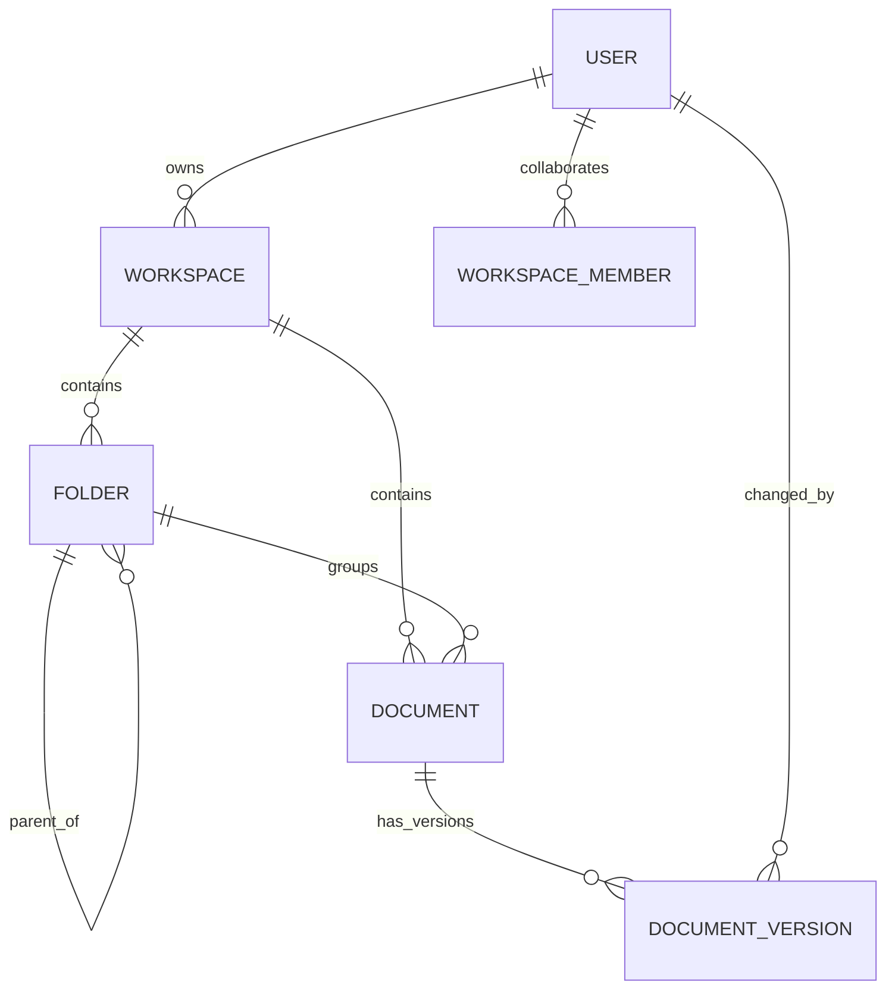

# Database Schema Design

## Overview
This backend uses MongoDB with Mongoose.
Primary collections:
- users
- workspaces
- folders
- documents
- documentversions

## Entity Relationship Map

## Collections

### users
Purpose:
- Account, auth state, and active sessions.

Key fields:
- name: String, required
- email: String, required, unique, lowercase
- password: String, required, bcrypt hash
- isEmailVerified: Boolean
- emailVerificationTokenHash, emailVerificationTokenExpiresAt
- passwordResetTokenHash, passwordResetTokenExpiresAt
- sessions[]:
  - tokenHash
  - expiresAt
  - userAgent
  - ip

Indexes:
- unique email

### workspaces
Purpose:
- Top-level collaboration container.

Key fields:
- name: String, required
- description: String
- owner: ObjectId -> users
- members[]:
  - user: ObjectId -> users
  - role: enum(editor, commenter, viewer)

Derived owner role:
- Owner is implicit via owner field and is not duplicated in members.

Indexes:
- { owner: 1, createdAt: -1 }
- { members.user: 1, createdAt: -1 }

Validation:
- members.user must be unique per workspace document.

### folders
Purpose:
- Hierarchical structure inside a workspace.

Key fields:
- name: String, required
- workspace: ObjectId -> workspaces
- parentFolder: ObjectId -> folders, nullable
- owner: ObjectId -> users (creator/legacy ownership)

Indexes:
- { owner: 1, workspace: 1, parentFolder: 1, createdAt: -1 }
- { workspace: 1, parentFolder: 1, createdAt: -1 }

### documents
Purpose:
- Content records edited collaboratively.

Key fields:
- title: String, required
- content: String
- workspace: ObjectId -> workspaces
- folder: ObjectId -> folders, nullable
- owner: ObjectId -> users (creator/legacy ownership)

Indexes:
- { owner: 1, workspace: 1, updatedAt: -1 }
- { workspace: 1, folder: 1, updatedAt: -1 }

### documentversions
Purpose:
- Immutable snapshots for create/update/restore operations.

Key fields:
- document: ObjectId -> documents
- workspace: ObjectId -> workspaces
- versionNumber: Number, incrementing per document
- changeType: enum(create, update, restore)
- changedBy: ObjectId -> users
- sourceVersion: ObjectId -> documentversions, nullable
- snapshot:
  - title
  - content
  - folder

Indexes:
- unique { document: 1, versionNumber: -1 }
- { workspace: 1, document: 1, createdAt: -1 }
- { changedBy: 1, createdAt: -1 }

## Role-Based Access Model
Roles:
- owner
- editor
- commenter
- viewer

Permission summary:
- owner: full access + manage members
- editor: read and edit workspace content
- commenter: read-only content access
- viewer: read-only content access

Enforcement:
- Access is checked by workspace membership/ownership before folder/document operations.
- Document and folder queries are workspace-scoped.

## Data Integrity Rules
- Deleting a workspace removes related folders, documents, and documentversions.
- Deleting a folder subtree removes descendant folders, subtree documents, and their versions.
- Deleting a document removes its versions.
- Restoring a version creates a new version snapshot to preserve audit continuity.

## Notes for Future Evolution
- If needed, replace folders.owner/documents.owner with createdBy for semantic clarity.
- Add soft-delete fields (deletedAt, deletedBy) when recycle-bin behavior is required.
- Consider transactional writes for high-concurrency versioning using MongoDB sessions.
